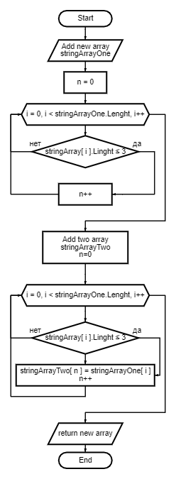

# Итоговоя проверочная работа #
<h1 align="center">Hi there, I'm<a href="https://github.com/RemoveFire/" target="_blank">Viktor</a> 
</h1>
 
<h1 align="center"></h1>
 
  * Вы находимтесь в аккаунте **[RemoveFire](https://github.com/RemoveFire)**. 
  * Заканчиваю курс по изучению основ в языке ***C #***.
  * И в данный момент я обучаюсь ***Python***. 
---
<b align="center">

 ## <a name="contacts">***Контактная информация:***</a>    
  
 __E'mail:__ *<siv.vitya@yandex.ru>*    

 __Telegram:__ *[@removefire](https://t.me/removefire)*  

 __Steam:__ *[Vityusha](https://steamcommunity.com/profiles/76561198037300364/)*  
 
</b>

---

<h2 align="center"><b> Задача: </b></h2>
Написать программу, которая из имеющегося массива строк формирует массив из строк, длинна которох меньше либо равнв 3 символам.
Первоначальный массив можно ввести с клавиатуры, либо задать на старте выполнения аогоритма.
При решении не рекомендуется пользоваться коллекциями, лучше обойтись исключительно массивами.

<b> Примеры:</b>

__*[“Hello”, “2”, “world”, “:-)”] → [“2”, “:-)”]*__

__*[“1234”, “1567”, “-2”, “computer science”] → [“-2”]*__

__*[“Russia”, “Denmark”, “Kazan”] → []*__

---

<h2 align="center"><b> Алгоритм решения </b></h2>

  1. Перебирпем значения исходного массива.
  2. Проверяем каждое знаение массва по очереди на соответствие условию: длинна строки меньше или равна трем (3).
  3. Если условия выполняются выбранной строкой из исходного массива то данное значение кладем в новый массив.
  4. Повторяем пункты 2 и 3 до тех пор пока не достигнем конца исходного массива.
  5. Возращаем новый заполненый массив как результат.

---

<h2 align="center"><b> Блок-схема алгоритма решения задачи </b>
 
 
 
</h2>

Пример работы программы: 

Если желаете ввести массив с клавиатуры, то введите: k

Или если желаете заполнить случайно, то введите: r

Введите значение:k
Введите слова через пробел: 
hello 2 world ^-^
Массив: [hello 2 world ^-^]
И получилось из него:      
Массив: [2 ^-^]
---

  
